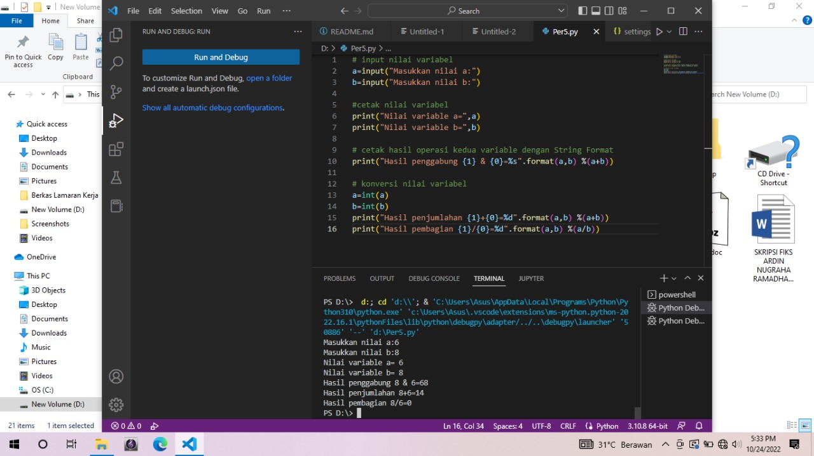

Langkah Langkah Instalasi Python
Buka Chrome lalu download python di situs python.org
Contoh Perintah Dasar Python                         
nama = input ("siapa nama kamu :")
alamat = input("dimana alamatmu:")

#  Latihan 1

• Menjalankan Python Console  
• Menampilkan tulisan "Hello" dilayar"  
• Menampilkan tulisan "Mengetik dari console"  

#  Latihan 2 

• Menjumlahkan dua buah bilangan menggunakan variabel a dan b.  
• Mendefinisikan variable a dengan nilai 10  
• Mendefinisikan variable b dengan nilai 9  
• Mencetak nilai variable a dan b  
• Mencetak hasil penjumlahan a+b  

```py
a = 10  
b = 9  
print ("variable a= ",a)  
print ("variable b= ",b)  
print ("hasil penjumlahan a+b ",a+b)  
```

# Latihan 3   
1.Jalankan IDLE   
2.Buat file baru dengan nama latihan3.py 
3.Gunakan fungsi input untuk mengambil nilai
```py
# input nilai variabel
a=input("Masukkan nilai a:")
b=input("Masukkan nilai b:")

#cetak nilai variabel
print("Nilai variable a=",a)
print("Nilai variable b=",b)

# cetak hasil operasi kedua variable dengan String Format
print("Hasil penggabung {1} & {0}=%s".format(a,b) %(a+b))

# konversi nilai variabel
a=int(a)
b=int(b)
print("Hasil penjumlahan {1}+{0}=%d".format(a,b) %(a+b))
print("Hasil pembagian {1}/{0}=%d".format(a,b) %(a/b))
```

